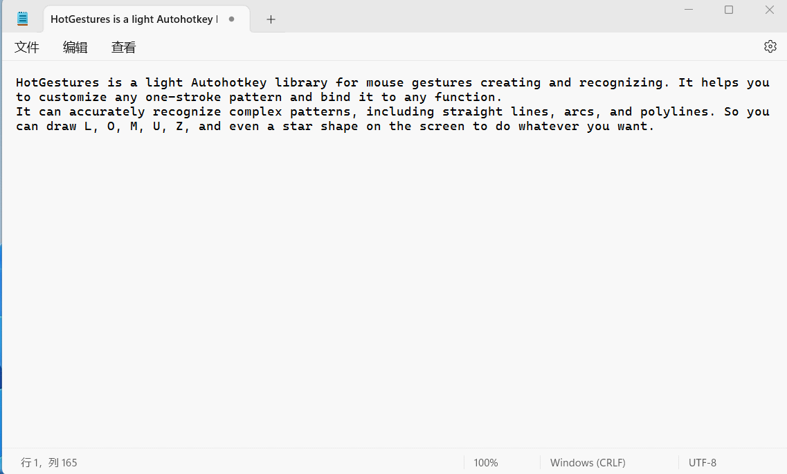
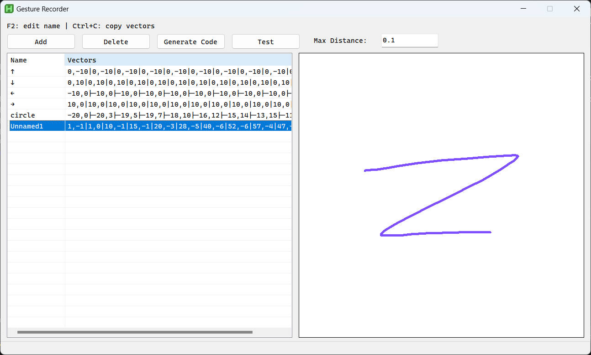

# HotGestures
This is a light Autohotkey library for mouse gestures creating and recognizing. It helps you to customize any one-stroke pattern and bind it to any function.  
It can accurately recognize complex patterns, including straight lines, arcs, and polylines. So you can draw L, O, M, U, Z, and even a star shape on the screen to do whatever you want.

## How it works
HotGestures recognizes mouse gestures by measuring the similarity of two sets of vectors through the DTW(Dynamic Time Warping). What we need to do is to provide several sets of vectors describing the mouse gestures as standard patterns. When we do a gesture, it compares the current mouse track with all the saved patterns and selects the closest one from the matched patterns.
## Vectors generation
A gesture can be seen as a set of vectors. HotGestures saves and parses string describing vectors in this format: `[NAME:]X1,Y1[|X2,Y2]...`
#### For example:
```
Right-slide:10,0|10,0|10,0

Left-slide:-10,0|-10,0|-10,0

Circle:-20,0|-20,3|-19,5|-19,7|-18,10|-16,12|-15,14|-13,15|-11,17|-9,18|-6,19|-4,20|-1,20|1,20|4,20|6,19|9,18|11,17|13,15|15,14|16,12|18,10|19,7|19,5|20,3|20,0|20,-3|19,-5|19,-7|18,-10|16,-12|15,-14|13,-15|11,-17|9,-18|6,-19|4,-20|1,-20|-1,-20|-4,-20|-6,-19|-9,-18|-11,-17|-13,-15|-15,-14|-16,-12|-18,-10|-19,-7|-19,-5|-20,-3
```
Manually writing of these is a bit of an imposition. Fortunately, you can use the GestureRecorder to generate them.

Start GestureRecorder, draw gestures on the whiteboard with the left button, and then you will see the vectors in the listview, just select it and press Ctrl-C to copy it.  
When you are done with all the gestures recording and naming, click the "Generate Code" button and you'll get a code template.

## Coding
#### This example shows how to create and register gestures.
```autohotkey
leftSlide := HotGestures.Gesture("Left-slide:-1,0") ; Create a left slide gesture
rightSlide := HotGestures.Gesture("Right-slide:1,0") ; Create a right slide gesture
hgs := HotGestures() ; New a HotGestures instance
; hgs.Register method requires a HotGestures.Gesture object, a string as comment, and a function as callback.
hgs.Register(leftSlide, "Switch window", _ => Send("!{Tab}"))
hgs.Register(rightSlide, "Next Window", _ => Send("+!{Tab}"))
hgs.Hotkey("RButton") ; set the RButton as the trigger
```
#### This demo creates two gesture groups containing identical gestures. But they serve different purposes in Notepad and Explorer windows, respectively.
```autohotkey
leftSlide := HotGestures.Gesture("Left-slide:-1,0")
rightSlide := HotGestures.Gesture("Right-slide:1,0")

notepadHgs := HotGestures()
notepadHgs.Register(leftSlide, "Backspace", _ => Send("{BackSpace}"))
notepadHgs.Register(rightSlide, "Wrap", _ => Send("{Enter}"))

explorerHgs := HotGestures()
explorerHgs.Register(leftSlide, "Back", _ => Send("!{Left}"))
explorerHgs.Register(rightSlide, "Forward", _ => Send("!{Right}"))

; use Hotif to create context-sensitive gesture trigger
HotIfWinactive("ahk_class Notepad")
notepadHgs.Hotkey("RButton")
HotIfWinactive("ahk_class CabinetWClass ahk_exe explorer.exe")
explorerHgs.Hotkey("RButton")
HotIfWinactive()
```
#### This example is a little more complex than the 2 above. Comparatively, this approach allows you to start or end gesture recording at any time, as well as control what to do in case of no match.
```autohotkey
; This is a M-Shape gesture
nShape := HotGestures.Gesture("M-Shape:0,-2|2,-4|3,-7|3,-9|3,-12|5,-14|5,-17|5,-20|6,-20|5,-22|5,-22|6,-24|5,-17|3,-10|1,-5|2,-3|3,2|5,11|8,21|9,22|9,29|7,23|5,21|5,18|5,12|3,8|1,5|1,3|1,2|1,-1|3,-5|4,-10|6,-10|8,-16|8,-14|10,-21|8,-18|5,-16|6,-19|5,-16|4,-15|2,-8|2,-4|1,-2|1,-1|1,0|2,2|2,4|3,9|3,12|6,16|9,30|11,29|10,28|8,24|6,19|3,15|3,11|1,8|1,6|0,5|0,3
")
; This is a Z-Shape gesture
zShape := HotGestures.Gesture("Z-Shape:0,-1|0,-1|6,-1|13,-1|16,-1|21,-1|21,-2|21,-1|14,0|11,0|7,0|3,1|2,1|-2,3|-5,4|-7,6|-18,11|-18,10|-19,9|-20,9|-31,12|-22,9|-18,9|-8,5|-1,2|6,1|15,-1|20,-1|25,-2|25,-3|24,-3|19,-1|15,-1|10,0|5,0|3,0|2,0")

hgs := HotGestures()
hgs.Register(nShape, "Maximize/Restore current window")
hgs.Register(zShape, "Minimize current window")

$RButton::{
    hgs.Start() ; Start recording
    KeyWait("RButton") ; Keep recording until RButton is released
    hgs.Stop() ; Stop recording
    if hgs.Result.Valid { ; Check validity of result
        switch hgs.Result.MatchedGesture { ; hgs.Result.MatchedGesture is the matched gesture object
            case nShape: try WinGetMinMax(WinExist("A")) ? WinRestore() : WinMaximize()
            case zShape: try WinMinimize("A")
            case "": return ; hgs.Result.MatchedGesture is an empty string if no match
        }
    }
    ; if no movement or track is too short, hgs.Result.Valid is false, and a right click is expected
    else {
        Send("{RButton}")
    }
}
```
#### Parameters：
- maxDistance indicates the maximum distance (0~2), the smaller the value, the stricter the recognition.
- minTrackLen indicates the shortest track length required in pixels, if the length of the mouse track is less than this value, the gesture is considered invalid.
- penColor indicates the color of the track.
```autohotkey
hgs := HotGestures(maxDistance := 0.1, minTrackLen := 100, penColor := 0xFE4F7F)
```